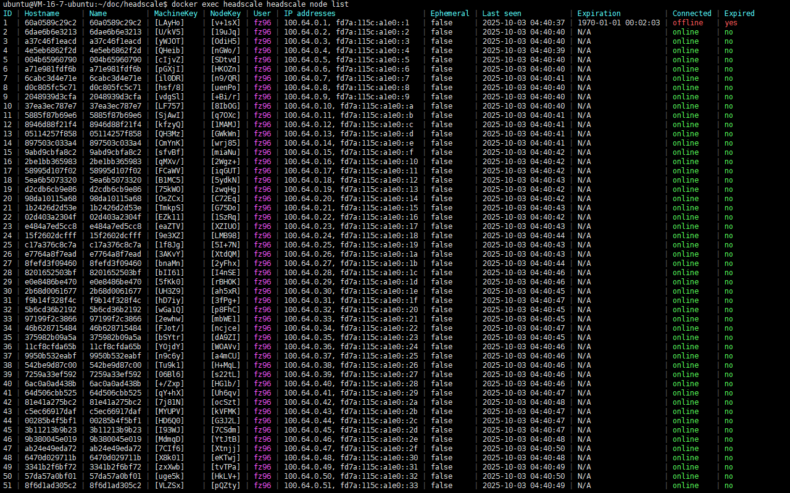
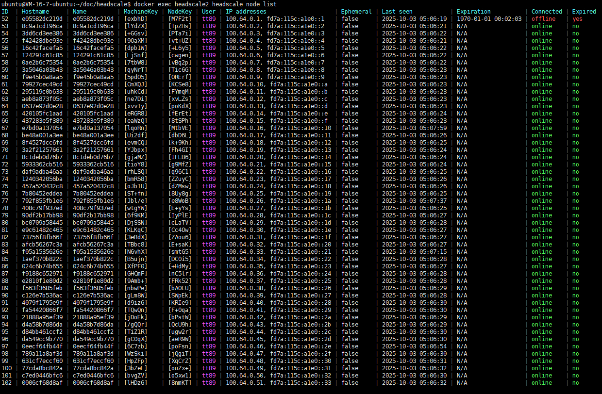
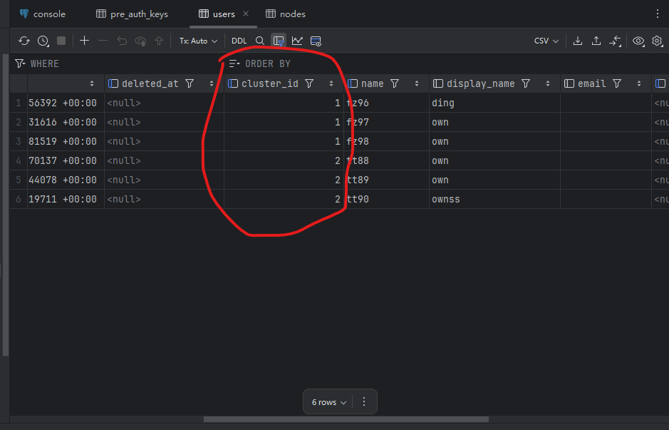
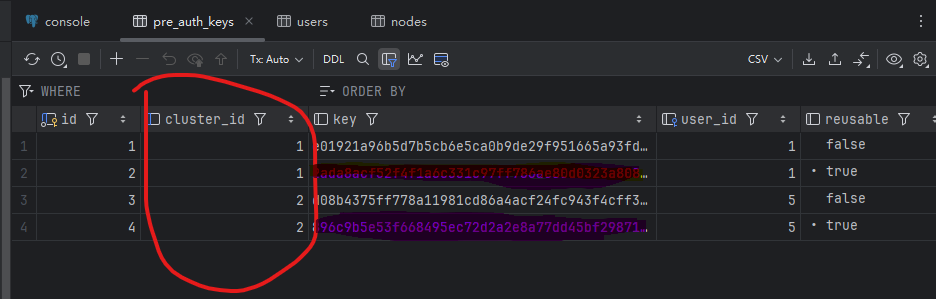
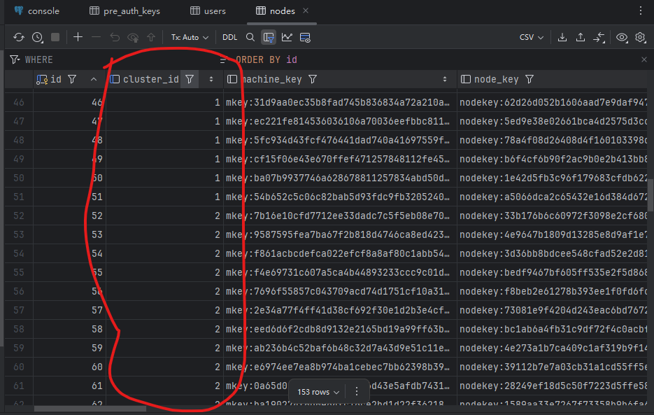

# Headscale SaaS - 可横向扩展的 Tailscale 控制服务器

[English below](#headscale-saas-scalable-tailscale-control-server-as-a-service)


[](https://opensource.org/licenses/MIT)


## 🌐 概述

**Headscale SaaS** 是一个基于 [headscale](https://github.com/juanfont/headscale) 修改和增强的多租户、可横向扩展的 `headscale` 控制服务器（Control Plane）解决方案。通过引入集群化架构和 `PostgreSQL` 共享存储，我们实现了 **无限设备支持能力** 和 **高可用性 SaaS 服务能力**。

传统 headscale 单节点部署受限于单机性能，难以支撑大规模设备接入。本项目通过引入 **cluster_id** 机制，将多个 headscale 实例组织成一个逻辑集群，每个实例负责部分流量与注册请求，从而实现水平扩展。

---

## 🚀 核心特性

- ✅ **横向扩展能力**：支持部署多个 headscale 节点组成集群，理论上支持无限数量的设备。
- ✅ **统一数据管理**：所有 headscale 节点共享同一个 PostgreSQL 集群，确保用户、节点、密钥等数据一致性。
- ✅ **cluster_id 隔离机制**：每个 headscale 节点拥有唯一 `cluster_id`，用于标识其在集群中的身份，避免资源冲突。
- ✅ **无缝兼容 Tailscale 客户端**：完全兼容原生 Tailscale 协议，客户端无需修改即可接入。

---

## 🧩 架构设计

```
                       +-----------------------+
     注册/登录/扩容 --->|  接入控制程序 (ACS)   |<---- 管理API/计费/配额
                       +----------+------------+
                                  |
                         选择可用 clusterID
                                  v
      +---------------------------+------------------------------+
      |                           |                              |
+-----+-----+               +-----+-----+                  +-----+-----+
| headscale |               | headscale |                  | headscale |
|  node A   | clusterID=A   |  node B   | clusterID=B      |  node C   | clusterID=C
+-----+-----+               +-----+-----+                  +-----+-----+
      \                           |                              /
       \                          |                             /
        \--------------------+----+----+-----------------------/
                             |  共享 PG/PG 集群  |
                             | (带 cluster_id 维度) |
                             +---------------------+

设备侧：
   Client 在首次接入时 -> 请求 ACS -> 获得 “可用 headscale 节点地址 + clusterID + 注册信息”
   之后所有交互都直连对应节点（黏住），横向扩容时通过 ACS 做新租户的分配。

```

- 所有 headscale 节点连接到同一个高可用 PostgreSQL 集群。
- 设备注册时由负载均衡器分发到任意节点，通过数据库锁与状态同步保证一致性。
- 每个节点的 `cluster_id` 在配置中指定，用于日志追踪、审计及未来策略控制。

---

## 🔧 快速开始

### 前提条件

- PostgreSQL 13+（推荐集群模式，如 Patroni + HAProxy）
- Go 1.24+
- Docker / Kubernetes（可选）

### 部署步骤

1. 克隆仓库：

```bash
git clone https://github.com/OwnDing/headscale-saas.git
cd headscale-saas
```

2. 配置 `config.yaml` 示例：

```yaml
# headscale will look for a configuration file named `config.yaml` (or `config.json`) in the following order:
#
# - `/etc/headscale`
# - `~/.headscale`
# - current working directory

# The url clients will connect to.
# Typically this will be a domain like:
#
# https://myheadscale.example.com:443
#
server_url: http://ip:port

# Cluster identifier used for multi-cluster deployments.
# All database records written by this instance will be tagged with this value.
cluster_id: 1

```

3. 构建并运行：

```bash
docker load -i h.tar
sudo docker run -d --name headscale -p 8080:8080 -p 9090:9090 -p 50443:50443 -v /home/ubuntu/doc/headscale/config.yaml:/etc/headscale/config.yaml   -v ./data-config/:/var/lib/headscale/ headscale:c1 serve
```

4. 使用 Nginx 或 Traefik 做前端负载均衡，将请求分发至不同 cluster 节点。


---

## 🤝 贡献

欢迎提交 Issue 或 Pull Request！请遵循 [Contributing Guide](CONTRIBUTING.md)。

---

## 📄 许可证

MIT License - 查看 [LICENSE](LICENSE) 获取详情。

---

# Headscale SaaS - Scalable Tailscale Control Server as a Service

[](https://opensource.org/licenses/MIT)

## 🌐 Overview

**Headscale SaaS** is an enhanced, multi-tenant, horizontally scalable version of [headscale](https://github.com/juanfont/headscale), designed to function as a production-ready **Tailscale Control Plane SaaS**.

By introducing a **cluster_id** mechanism and shared PostgreSQL storage, multiple headscale instances can work together as a unified cluster, enabling **unlimited device scalability** and **high availability**.

Traditional headscale deployments are limited by single-node capacity. This project breaks that barrier by allowing you to deploy many headscale nodes — each with a unique `cluster_id` — all sharing the same backend database.

---

## 🚀 Key Features

- ✅ **Horizontal Scalability**: Deploy multiple headscale nodes across regions or data centers.
- ✅ **Unified Data Layer**: All nodes connect to a shared PostgreSQL cluster for consistent state management.
- ✅ **cluster_id Isolation**: Each node has a unique `cluster_id`, preventing conflicts and enabling routing/logic control.
- ✅ **Tailscale Protocol Compatible**: Works seamlessly with official Tailscale clients (no modifications needed).

---

## 🧩 Architecture

```
                       +-----------------------+
   Register/Login ---> |  Admission/Control    | <--- Admin API/Billing/Quotas
       / Scale         |       Service (ACS)   |
                       +----------+------------+
                                  |
                          choose clusterID
                                  v
      +---------------------------+------------------------------+
      |                           |                              |
+-----+-----+               +-----+-----+                  +-----+-----+
| headscale |               | headscale |                  | headscale |
|  node A   | clusterID=A   |  node B   | clusterID=B      |  node C   | clusterID=C
+-----+-----+               +-----+-----+                  +-----+-----+
      \                           |                              /
       \                          |                             /
        \--------------------+----+----+-----------------------/
                             |   Shared Postgres / PG Cluster  |
                             |     (cluster_id dimension)      |
                             +---------------------------------+

Clients:
  On first join -> call ACS -> receive "available headscale address + clusterID + registration info"
  Then all traffic sticks to that node. New tenants are placed by ACS during scale-out.

```

- All headscale nodes connect to the same highly available PostgreSQL cluster.
- Device registration requests are load-balanced across nodes; consistency is ensured via DB-level locking and atomic operations.
- The `cluster_id` is configured per instance and used for logging, monitoring, and future policy enforcement.

---

## 🔧 Quick Start

### Prerequisites

- PostgreSQL 13+ (HA setup recommended)
- Go 1.24+
- Docker / Kubernetes (optional)

### Deployment Steps

1. Clone the repo:

```bash
git clone https://github.com/OwnDing/headscale-saas.git
cd headscale-saas
```

2. Configure `config.yaml`:

```yaml
---
# headscale will look for a configuration file named `config.yaml` (or `config.json`) in the following order:
#
# - `/etc/headscale`
# - `~/.headscale`
# - current working directory

# The url clients will connect to.
# Typically this will be a domain like:
#
# https://myheadscale.example.com:443
#
server_url: http://ip:port

# Cluster identifier used for multi-cluster deployments.
# All database records written by this instance will be tagged with this value.
cluster_id: 1

```

3. Build and run:

```bash
docker load -i h.tar
sudo docker run -d --name headscale -p 8080:8080 -p 9090:9090 -p 50443:50443 -v /home/ubuntu/doc/headscale/config.yaml:/etc/headscale/config.yaml   -v ./data-config/:/var/lib/headscale/ headscale:c1 serve
```

4. Use a reverse proxy (Nginx/Traefik) to balance traffic among cluster nodes.


---

## 🤝 Contributing

Issues and PRs are welcome! Please follow the [Contributing Guide](CONTRIBUTING.md).

---

## 📄 License

MIT License - see [LICENSE](LICENSE) for details.











